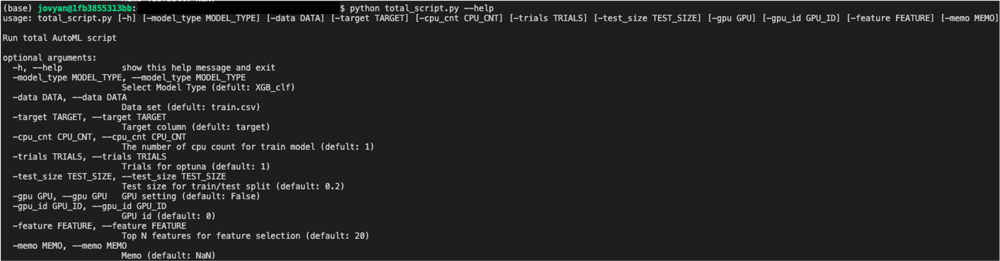
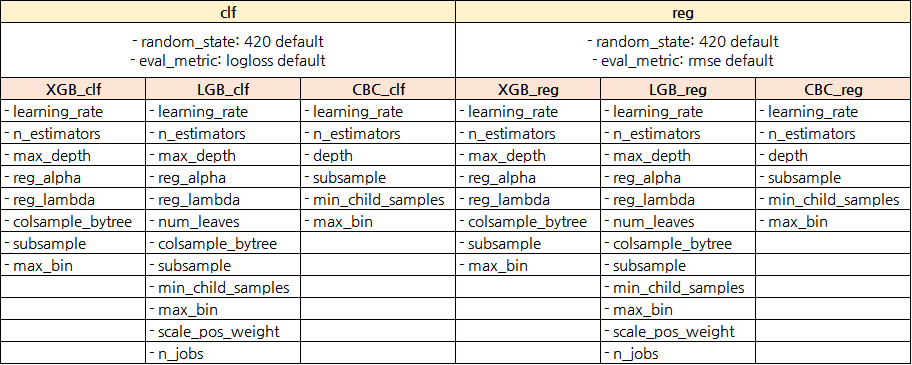

# 목차
[1. 개발 동기](#motivation)

[2. 기본 기능](#basic-function)

[3. 폴더 목록](#folder-list)


[4. 파일 목록](#file-list)


[5. 실행 메뉴얼](#script-manual)


[6. 부록](#etc)

* 참고: https://agilesoda.notion.site/AutoML-68006cf33b21473da9045ae8ad9a12a2

<hr>

### 1. 개발 동기 <span id="motivation"><span>
완벽한 AutoML 은 아니지만 모델 학습에 필요한 기능들 (**전처리 제외**) 을 스크립트형식으로 만든 파일들입니다. 사이트에 가셔서 조금씩만 수정해 주셔도 사용이 가능하기 때문에 모델 개발을 조금이나마 수월하게 하고자 하는 취지로 개발하였습니다.
<hr>
    
### 2. 기본 기능 <span id="basic-function"><span>
* db로부터 data 추출(option)
* 모델 선정(option)
* Feature Elimination
* EDA
* optuna를 통한 하이퍼파라미터 튜닝
* 모델 학습 및 output 산출
    - 단, multi classification 불가능

    
<hr>
    
### 3. 폴더 목록 <span id="folder-list"><span>
- query: get_dataset.py 실행 시 필요한 SQL파일이 저장된 폴더
- images: README.md images 폴더
- model_result: model 학습 후 model 별 폴더에 결과 & model 저장  
    **[e.g]**
    - CBC_clf 폴더 > CBC_clf(model), CBC_clf_score.csv 저장  
- origin_data: train을 위한 원본 데이터 저장 폴더(feature selection 이전의, 전처리가 끝난 원본)
- feature_output: visualization, EDA, feature_importances list가 저장되는 폴더  
    **[e.g]**
    - CBC_clf_feature_importances.pkl(feature_importance score file)
    - CBC_clf_importances.png(feature_importance graph image)
    - CBC_clf_SHAP.png(feature_importance SHAP image)
    - EDA.html(pandas_profiling.ProfileReport html)  
- params: optuna_best_parameter.py의 최적 paramter 결과물  
    **[e.g]**
    - Best_Params_CBC_clf.csv
- preprocess_data: feature.py 실행 후 feature selection된 컬럼만 남겨진 csv 파일

<hr>
    
### 4. 파일 목록 <span id="file-list"><span>
#### get_dataset.py
- MySQL db로부터 data 추출 후 origin_data에 csv 혹은 pickle 형태로 저장
- total_script.py에서 실행 subprocess가 주석처리 되어있으므로, 사용 시 주석 해제

#### vanilla_cv.py
- 바닐라 모델 검증을 원할 시에 실행 가능한 파일
- 여러 모델들을 추가하면 간략한 성능을 비교할 수 있어 모델 선정에 도움
- 처음 baseline 실험용으로 사용 가능(필수 요소가 아닌 선택 사항)

#### feature.py
- EDA
- 특정 model에 기반한 feature importance 파악
- SHAP를 통한 feature importance 파악
- RFE를 통한 Feature Elimination 진행
    
#### optuna_best_parameter.py
- feature.py를 통해 최적의 feature를 찾은 후 hyperparameter 탐색 및 저장
- optuna_best_parameter.py의 parameter list는 [6. 부록](#etc) 참고
    
#### train.py
- 선택된 model에 best hyperparamter 적용 후, preprocess_data 폴더 내 데이터로 학습
- 학습후 model 및 결과 저장
- ROC_curve graph image 저장
- model 저장 및 load는 [6. 부록](#etc) 참고

<hr>
    
    
### 5. 실행 메뉴얼 <span id="script-manual"><span>    
#### 5-1. 실행전 체크리스트
#### Version 확인 필수
- python == 3.3.6
- pip == 20.3.3

**0) 데이터 추출을 위한 준비**
- [ ]  total_script.py에서 주석 해제
- [ ]  db_config.env 파일에 목록에 맞는 내용 작성
- [ ]  QUERY의 경우 QUERY문이 별도로 저장되어 있는 SQL파일 경로 작성

    e.g) QUERY = ‘/query/test_query.sql’

**1) 데이터 준비**
- [ ] NaN값 처리되었는지 확인
- [ ] 결측치 처리되었는지 확인
- [ ] object타입이 있는지 확인 (있을 경우 int 혹은 float타입으로 변경)
- [ ] 위 과정을 마친 데이터 형식이 csv혹은 pkl 형식인지 확인 (csv, pkl 형식만 사용가능)
    
**2) 데이터 경로 확인**
- [ ] origin_data 폴더에 1)번 과정이 끝난 데이터가 들어있는지 확인
- [ ] feature.py를 실행시키지 않을 경우, preprocess_data 폴더에 모든 전처리가 끝난 데이터가 들어있는지 확인

**3) 기타 사항 확인**
- [ ] total_script.py 실행을 위한 target(y값) column명 확인  
- [ ] 사용가능한 gpu 자원 확인 (cli 명령어: nvidia-smi)
    
    
#### 5-2. git clone
```
git clone https://gitlab.com/consulting10/automl.git 
```

#### 5-3. requirements 설치
```
pip install -r requirements.txt
```

#### 5-4. total_script.py 실행을 위한 arguments 파악
```
python total_script.py --help
```

##### Output 예시)


    
##### option 설명
- -model_type: model type 선택
    - default = XGB_clf
    - 사용가능 option = XGB_clf, XGB_reg, CBC_clf, CBC_reg, LGB_clf, LGB_reg
- -data : 학습을 위한 data(csv, pkl 형식만 가능)
    - feature.py를 실행하지 않고 optuna.py를 바로 실행 시 data는 preprocess_data fold에 있어야함
    - default = train.csv
- -target: data의 target column name 입력
    - default = target
- -cpu_cnt: 사용할 cpu 개수 선택
    - default = 1
- -trials: optuna.py에서 optuna study.optimize 진행 시 n_trial 값
    - default = 1
- -test_size: test_size 값 설정
    - default = 0.2
- -gpu: gpu 설정(XGB, CBC만 가능)
    - default = False
- -gpu_id: gpu_id 설정
    - default = 0
- -feature: RFE feauture 선택 시 1 step 별 선택하는 feature 개수
    - default = 20
- -memo: train.py 중 model score 기록 시 memo 기록 (memo에는 공백대신 _로 채우기)
    - default = NaN


#### 5-5. total_script.py 실행
**실행 예시**
```
python total_script.py -model_type CBC_reg -data train.csv -target label 
```

**일부 기능만 실행 시 주석 처리 후 진행 [6. 부록](#etc) 참고**

**MySQL db 데이터 변환은 주석처리 돼있으므로 사용 시 주석 해제**
    
<hr>
    
    
### 6. 부록 <span id="etc"><span>

#### 6-1. parameter list
<!-- <center> -->

<!-- </center> -->
    
<!-- | clf                                                       |                     |                     | reg                                                    |                     |                     |
|-----------------------------------------------------------|---------------------|---------------------|--------------------------------------------------------|---------------------|---------------------|
| - random_state: 420 default                               |                     |                     | - random_state: 420 default                            |                     |                     |            
| - eval_metric: logloss default                            |                     |                     | - eval_metric: rmse default                            |                     |                     |
| XGB_clf                                                   | LGB_clf             | CBC_clf             | XGB_reg                                                | LGB_reg             | CBC_reg             |
| - learning_rate                                           | - learning_rate     | - learning_rate     | - learning_rate                                        | - learning_rate     | - learning_rate     |
| - n_estimators                                            | - n_estimators      | - n_estimators      | - n_estimators                                         | - n_estimators      | - n_estimators      |
| - max_depth                                               | - max_depth         | - depth             | - max_depth                                            | - max_depth         | - depth             |
| - reg_alpha                                               | - reg_alpha         | - subsample         | - reg_alpha                                            | - reg_alpha         | - subsample         |
| - reg_lambda                                              | - reg_lambda        | - min_child_samples | - reg_lambda                                           | - reg_lambda        | - min_child_samples |
| - colsample_bytree                                        | - num_leaves        | - max_bin           | - colsample_bytree                                     | - num_leaves        | - max_bin           |
| - subsample                                               | - colsample_bytree  | - scale_pos_weight  | - subsample                                            | - colsample_bytree  | - scale_pos_weight  |
| - max_bin                                                 | - subsample         |                     | - max_bin                                              | - subsample         |                     |
|                                                           | - min_child_samples |                     |                                                        | - min_child_samples |                     |
|                                                           | - max_bin           |                     |                                                        | - max_bin           |                     |
|                                                           | - scale_pos_weight  |                     |                                                        | - scale_pos_weight  |                     |
|                                                           | - n_jobs            |                     |                                                        | - n_jobs            |                     | -->
    
    
#### 6-2. model save and load
    
e.g. model save code(train.py에 존재)
```
pickle.dump(final_model, open(f'{os.getcwd()}/model_result/CBC_clf/CBC_clf', 'wb'))
```

e.g. model load code (model load는 별도 진행)
```
model = pickle.load(open(f'{os.getcwd()}/model_result/CBC_clf/CBC_clf', 'rb'))
```
    
    
#### 6-3. 일부 기능 실행

- total_script.py의 main 함수 중 subprocess 주석 처리 후 실행
- optuna_best_parameter.py를 실행하지 않고 train.py만 실행 시 parameter는 default로 진행